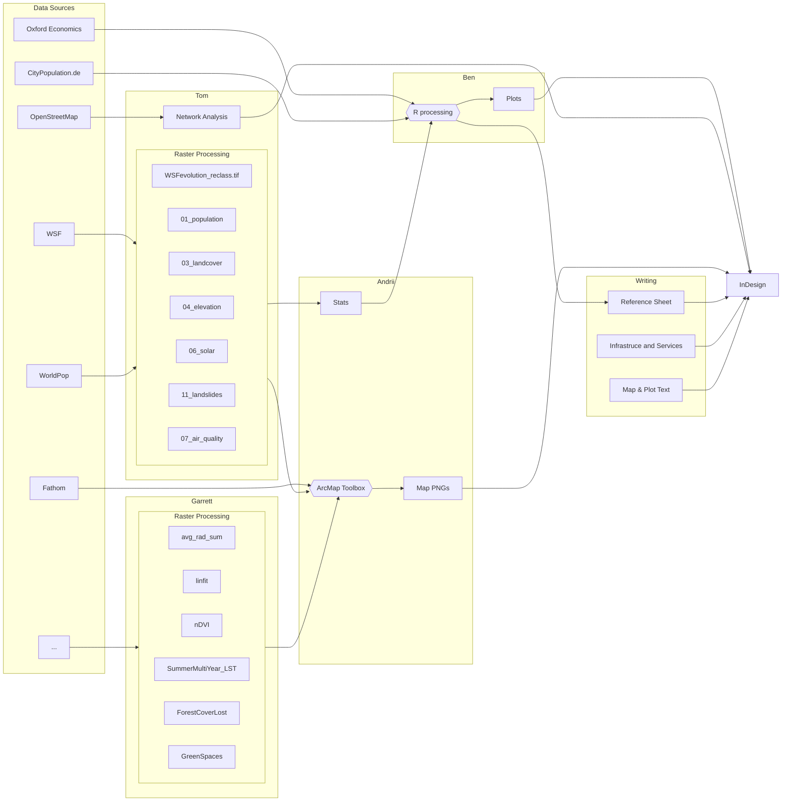
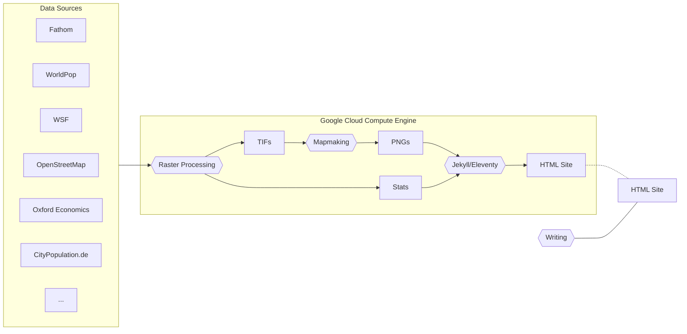

# City Scan Automation

This repository documents the front-end and back-end development of the City Scan Automation project, undertaken by the City Resilience Program.
The main languages used are Python and R.

## Inputs and Outputs

The inputs and outputs are located in `mnt/city-directories`.
The subdirectory `01-user-input` takes 2 input yaml files from the user, which specify the city name and AOI file path (`city_inputs.yml`), and analytical component selection (`menu.yml`).
The subdirectory `02-process-output` holds the output files from the back-end processing, which are then fed into the front-end processing.

## Back-end Processing

The back-end workflow automates the processing and clipping of global environmental and hazard datasets to the urban scale.

## Front-end Processing

The front-end workflow takes the back-end outputs and assembles them into a Quarto document, complete with a text narrative, statistical visualizations, and interactive maps.

## Workflow Improvement

One of the primary motivations for the City Scan Automation project is to drastically speed up and streamline the workflow.
The improvements can be visualized in the flow charts below:

### Original Workflow

Multi-actor, involving repetitive manual processes, high dependencies.

### Proposed Workflow

Streamlined, cloud-based,automated, and more efficient.

