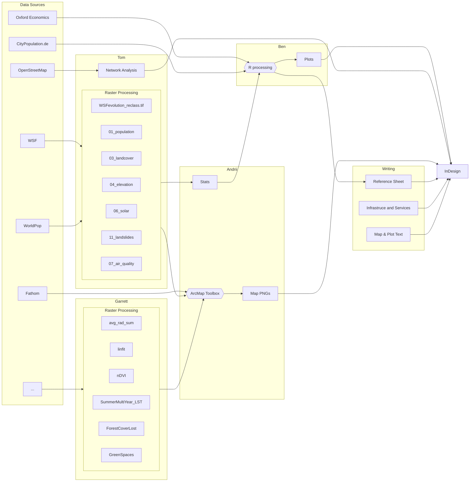
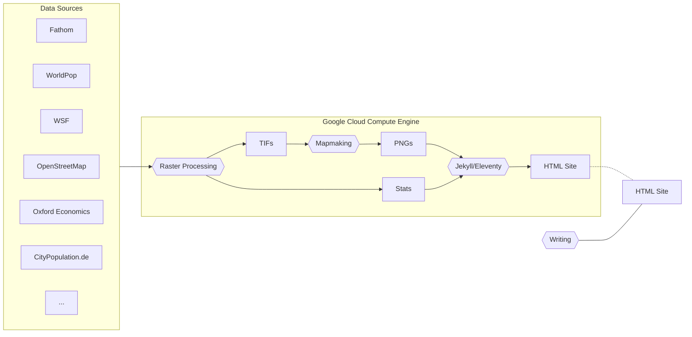

# city-scan-automation
City Scan Automation first phase

# Current Process

```mermaid
flowchart LR
	subgraph data[Data Sources]
		Fathom
		WorldPop
		WSF
		osm[OpenStreetMap]
		ox[Oxford Economics]
		citypop[CityPopulation.de]
		other[...]
	end
	other --> garrett_rasters
	subgraph Garrett
		subgraph garrett_rasters[Raster Processing]
			direction LR
			avg_rad_sum
			linfit
			nDVI
			SummerMultiYear_LST
			ForestCoverLost
			GreenSpaces
		end
	end
	subgraph tom[Tom]
		subgraph tom_rasters[Raster Processing]
			direction LR
			WSFevolution_reclass.tif
			01_population
			03_landcover
			04_elevation
			06_solar
			11_landslides
			07_air_quality
		end
		WSF --> tom_rasters
		WorldPop --> tom_rasters
		osm --> ntwrk[Network Analysis]
	end
	subgraph Andrii
		direction TB
		arc{{ArcMap Toolbox}} --> png[Map PNGs]
		Fathom --> arc
		tom_rasters --> stats[Stats]
		tom_rasters --> arc
		garrett_rasters --> arc
	end
	subgraph Ben
		stats --> rmd{{R processing}}
		rmd --> Plots
		ox --> rmd
		citypop --> rmd
	end
	Plots --> InDesign
	ntwrk --> InDesign
	png --> InDesign
	ref --> InDesign
	subgraph Writing
		rmd ----> ref[Reference Sheet]
		front[Infrastruce and Services]
		slide_text[Map & Plot Text]
	end
	front --> InDesign
	slide_text --> InDesign
```

## Proposed

```mermaid
flowchart LR
	subgraph data[Data Sources]
		direction LR
		Fathom
		WorldPop
		WSF
		osm[OpenStreetMap]
		ox[Oxford Economics]
		citypop[CityPopulation.de]
		other[...]
	end
	data --> rastering
	subgraph gcce[Google Cloud Compute Engine]
		rastering{{Raster Processing}}
		rastering --> TIFs
		TIFs --> mapping{{Mapmaking}}
		mapping --> PNGs
		rastering --> Stats
		PNGs --> jekyll{{Jekyll/Eleventy}}
		Stats --> jekyll
		jekyll --> html_internal[HTML Site]
	end
	html_internal[HTML Site] -.- html_external[HTML Site]
	writing{{Writing}} --- html_external[HTML Site]
```
